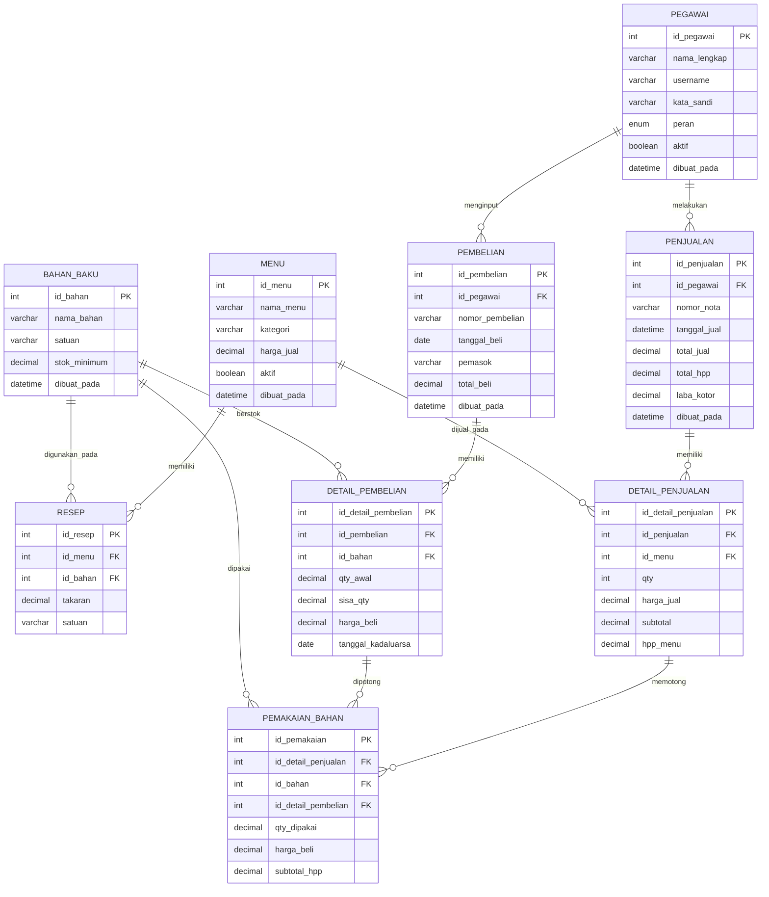

# Gambar 3.1 — Relasi Antar Tabel (ERD)
Aplikasi Penjualan Kasir dengan Perhitungan HPP Metode FIFO — Homwok Coffee

Notasi kaki gagak (*crow's foot*):
`||` = satu (one), `o{` = banyak (many). Jadi `||--o{` berarti **one to many**.

---

## A. Kode Mermaid (untuk dirender jadi gambar)

Salin kode di bawah ke https://mermaid.live atau menu *Insert → Mermaid* pada
draw.io, lalu ekspor sebagai gambar untuk dimasukkan ke dokumen sebagai Gambar 3.1.



---

## B. Diagram ASCII (panduan tata letak)

```
        ┌─────────────────┐
        │    PEGAWAI     │
        │  id_pegawai *  │
        └───────┬─────────┘
         1      │      1
      ┌─────────┴──────────┐
      │ N                  │ N
┌─────▼────────┐    ┌──────▼────────┐
│  PEMBELIAN   │    │   PENJUALAN   │
│ id_pembelian*│    │ id_penjualan* │
│ id_pegawai**│    │ id_pegawai** │
└─────┬────────┘    └──────┬────────┘
      │ 1                  │ 1
      │ N                  │ N
┌─────▼─────────────┐  ┌───▼──────────────────┐
│ DETAIL_PEMBELIAN  │  │  DETAIL_PENJUALAN     │
│ id_detail_pemb. * │  │ id_detail_penj. *     │
│ id_pembelian   ** │  │ id_penjualan       ** │
│ id_bahan       ** │  │ id_menu            ** │
│ sisa_qty (LOT)    │  └───────────┬──────────┘
└──────┬────────────┘              │ 1
       │ 1                         │ N
       │ N            ┌────────────▼───────────────┐
       └─────────────►│      PEMAKAIAN_BAHAN       │◄──── N
                      │ id_pemakaian            *  │      │ 1
                      │ id_detail_penjualan     ** │  ┌───┴──────────┐
                      │ id_detail_pembelian     ** │  │  BAHAN_BAKU  │
                      │ id_bahan                ** │◄─┤  id_bahan *  │
                      │ subtotal_hpp               │ N└───┬──────────┘
                      └────────────────────────────┘   1 │ N
                                                          │
        ┌──────────────┐  N        1   ┌─────────────────▼──┐
        │     MENU     ├───────────────►│       RESEP        │
        │  id_menu *   │  (menu→resep)  │  id_resep       *  │
        └──────┬───────┘                │  id_menu        ** │
               │ 1                       │  id_bahan       ** │ ◄── (bahan→resep)
               │ N (menu→detail_penj.)   │  takaran           │
               └───► DETAIL_PENJUALAN    └────────────────────┘
```

Keterangan: `*` = Primary Key, `**` = Foreign Key.

---

## C. Ringkasan 11 Relasi (one to many)

| No | Relasi | Kardinalitas |
|----|--------|--------------|
| 1 | pegawai → pembelian | 1 : N |
| 2 | pegawai → penjualan | 1 : N |
| 3 | menu → resep | 1 : N |
| 4 | bahan_baku → resep | 1 : N |
| 5 | pembelian → detail_pembelian | 1 : N |
| 6 | bahan_baku → detail_pembelian | 1 : N |
| 7 | penjualan → detail_penjualan | 1 : N |
| 8 | menu → detail_penjualan | 1 : N |
| 9 | detail_penjualan → pemakaian_bahan | 1 : N |
| 10 | detail_pembelian → pemakaian_bahan | 1 : N |
| 11 | bahan_baku → pemakaian_bahan | 1 : N |

Catatan: hubungan **many-to-many** antara `menu` dan `bahan_baku` diwujudkan
melalui tabel penghubung `resep` (relasi 3 dan 4). Hubungan many-to-many antara
`detail_penjualan` dan `detail_pembelian` (satu item menu dapat memotong banyak
lot, satu lot dapat melayani banyak item) diwujudkan melalui tabel `pemakaian_bahan`
(relasi 9 dan 10).
